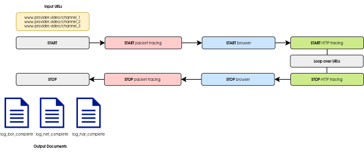

# streambot
A simple tool for automating Layer-2 and Layer-7 tracing on content provider websites (currently, Amazon Prime and DAZN are supported). It allows you to loop over a list of URL channels offered by the Content Provider, recording packet-level and HTTP-level data through Wireshark and HAR traces.

## Features
- Automates tracing for Content Providers like Amazon Prime and DAZN
- Loops over a list of channel URLs and records traces
- Captures both packet-level and application-level (HTTP) data

## Instructions

1. **Set up credentials and cookies:**
   - For each Content Provider folder, there are two files:
     - `scraping.js`: Automates the tracing process
     - `register.js`: Handles the sign-in process
     
   - Before running `scraping.js`, run `register.js` to save your credentials and cookies for subsequent logins. This will generate a folder called `user_data`.

2. **Run scraping.js:**
   - Once you’ve completed the sign-in process, you can run `scraping.js` to start the tracing of the channels.


## Configuration
You can configure the bot via the `config.yaml` file. The following parameters are available:

### 1. repetitions
- **Description**: Number of times to repeat the channel URLs list.
- Example:
  ```yaml
  repetitions: 3
  ```

### 2. load
- **Description**: Time in seconds between actions (e.g., clicking).
- Example:
  ```yaml
  load: 2
  ```

### 3. play
- **Description**: Time in seconds to watch a URL in the channel list.
- Example:
  ```yaml
  play: 10
  ```

### 4. homepage
- **Description**: The URL where the Content Provider lists all channels.
- Example:
  ```yaml
  homepage: "https://www.dazn.com/it-IT/home"
  ```

### 5. channels
- **Description**: List of channels to watch. Depending on the content provider web app, the channel object can be a link streambot clicks or rather a button streambot press.
- Example:
  ```yaml
  channels:
  - type:  "url"
    link:  "https://www.dazn.com/it-IT/home/f0fxplpta8y6r0j482bg311u1/1daica1elq2701s7zajjchy47s"
    name:  "radio-tv-serie-a"
  
  - type: "button"
    link: "[data-card-title='Eurosport 2 HD']"
    name: "eurosport2"
  ```
  ## Warning
  While DAZN offers full URL navigation across all channels, Amazon Prime does not. Currently, Amazon Prime's navigation across channels relies on intercepting relevant CSS selectors to be clicked in the HTML page. However, this methodology is prone to errors, especially if the web page's DOM is slow to fully render.
    
### 6. sniffer
- **Description**: Settings for the sniffer, including the path toward the executable file, the network interface toward Internet and the maximum size of the packet capture. Ensure a regular user can sniff without being a superuser.
- Example:
  ```yaml
  sniffer:
    bin: "/usr/bin/tshark"
    net: "enp1s0"
    max: 500
  ```

### 7. login
- **Description**: Settings for signing in (email and password).
- Example:
  ```yaml
  login:
    url: "https://www.example.com/login"
    username: "your-email@example.com"
    password: "your-password"
  ```

## Output

At the end of all repetitions, a folder named with the current date and time (i.e., `2025-03-12_14-23-45`) contains the output generated by streambot. For each repetition, a tuple of three documents is generated:

- **log_har_complete**  
  This document contains the complete HTTP Archive (HAR) log capturing all network interactions during the streambot session. It includes detailed information such as request and response headers, payloads, timings, and status codes. This log is valuable for troubleshooting network performance and debugging HTTP transactions.

- **log_bot_complete**  
  This file records the full log of the bot's operations. It details every action taken, events triggered, and other significant runtime information.

- **log_net_complete**  
  This document captures all network packets in standard .pcap format

<div align="center">
  
</div>

